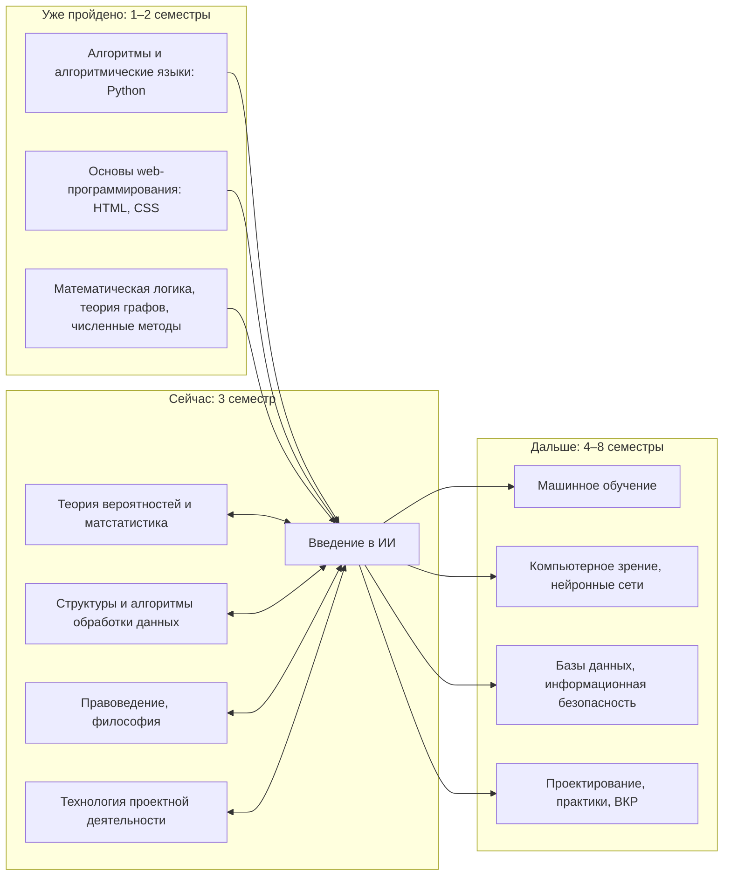

> **Первое занятие:** сначала [короткая инструкция](docs/ПЕРВЫЙ_СТАРТ.md). Если среда не работает — `00. Старт без установки.ipynb` или [HTML без Jupyter](docs/СТАРТ_БЕЗ_УСТАНОВКИ.html). GitHub нужен к следующему занятию, не для начала первой пары.

# Введение в искусственный интеллект

Практические занятия по дисциплине «Введение в искусственный интеллект» для направления 01.03.02 «Прикладная математика и информатика», профиль «Искусственный интеллект», СГУ им. Питирима Сорокина.

Курс о том, с чего начинается любой искусственный интеллект, — о данных: как их найти, собрать, сложить, почистить, понять, показать и не нарушить при этом закон. За семестр каждый студент делает собственный проект на настоящих данных.

Автор — Дуркин Анатолий Альбертович, старший преподаватель: anatoliy.durkin@mail.ru, Telegram @AnatoDu, канал https://t.me/smth_on_it

## С чего начать

1. Начните с [ПЕРВЫЙ_СТАРТ.md](docs/ПЕРВЫЙ_СТАРТ.md): готовый архив или скачивание курса, без обязательного Git.
2. Скопируйте **всю** `project_template/` в личное место и назовите, например, `ai_project`. Откройте Jupyter в ней, затем `workbooks/01.1 Курс и рабочее место.ipynb`. В комплекте уже есть проверки, данные и документация; соседняя папка курса не нужна.
3. Условия проекта — [ПРОЕКТ.md](docs/ПРОЕКТ.md), критерии оценки — [ОЦЕНИВАНИЕ.md](docs/ОЦЕНИВАНИЕ.md), как сдавать работы — [СДАЧА.md](docs/СДАЧА.md).
4. Установка дома — [УСТАНОВКА.md](docs/УСТАНОВКА.md).
5. Тренажёры, книги, фильмы, соревнования и стажировки по темам курса — [ПОЛЕЗНОЕ.md](docs/ПОЛЕЗНОЕ.md).

Компьютеры общие: личная папка, сохранение и проверенная копия. На первом блоке — без обязательного Git/аккаунта; к следующему занятию нужен GitHub. Подробно — в [ПЕРВЫЙ_СТАРТ.md](docs/ПЕРВЫЙ_СТАРТ.md).

## Занятия

Каждое занятие — две пары, на каждую пару своя тетрадь. Номер тетради `NN.M` читается так: занятие NN, пара M.

| № | Пара 1 | Пара 2 | Этап проекта |
|---|---|---|---|
| 1 | Курс, рабочее место и Git | Задача ИИ, ГОСТ и выбор темы | выбор трека |
| 2 | Pandas: первое знакомство | Титаник: первые выводы | ЛР1 |
| 3 | Парсинг сайтов | Законность сбора и большая таблица | — |
| 4 | API и форматы данных | Открытые источники и сбор своих данных | ЛР2 |
| 5 | Предобработка: пропуски и дубликаты | Аномалии и выбросы | — |
| 6 | Группировка и объединение в pandas | То же на SQL: знакомство с DuckDB | ЛР3 |
| 7 | SQL для аналитики: CTE и оконные функции | Слои хранилища и витрины | — |
| 8 | Визуализация: выбор графика | Дашборд и разведочный анализ | ЛР4 |
| 9 | Тренды ИИ в цифрах | Экономика проекта с данными | — |
| 10 | Разметка данных | Экспертные оценки и паспорт датасета | ЛР5 |
| 11 | Персональные данные | Безопасность данных и обезличивание | — |
| 12 | Этика и регулирование ИИ | Защита проектов | ЛР6 |

Тетради появляются к своему занятию. Для текущих занятий открывайте тетради из собственного `workbooks`. Публикуются только подготовленные занятия; остальные добавляются по мере прохождения курса.

## Как курс связан с другими дисциплинами



## Что в репозитории

```
01.1 …, 01.2 …          тетради занятий: NN.M — занятие и пара
course_support/        проверки, вспомогательные функции и учебные данные
docs/                   правила курса и шпаргалки
project_template/       готовый автономный старт вашего проекта
```

## Новые занятия без потери ответов

Репозиторий курса — источник выдачи; собственный проект студента — отдельный репозиторий, не fork. Не заменяйте весь свой проект новым шаблоном. Новые тетради копируйте только если такого имени ещё нет; исправления уже начатой тетради переносите выборочно либо сохраняйте новую версию под другим именем. `course_support/` — поставляемые вспомогательные файлы; их можно обновлять целиком из нового выпуска после сохранения копии и проверки изменений. README, notebooks, data и ответы студента никогда не заменяются автоматически. Подробно — docs/GIT.md.
